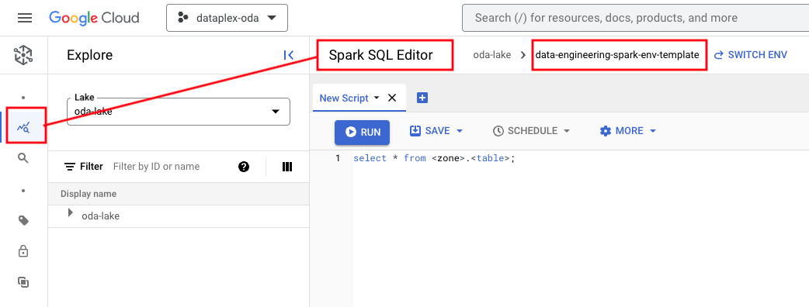
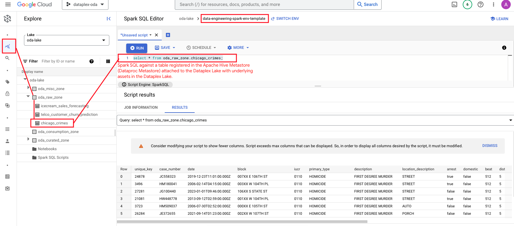
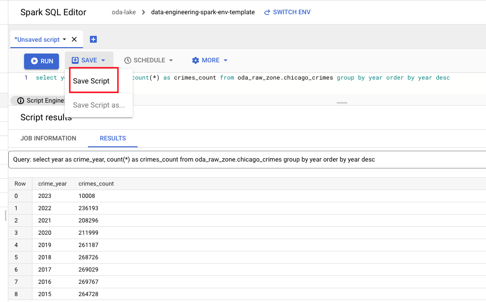
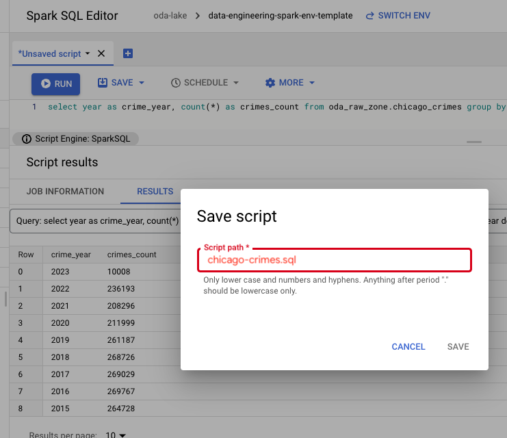
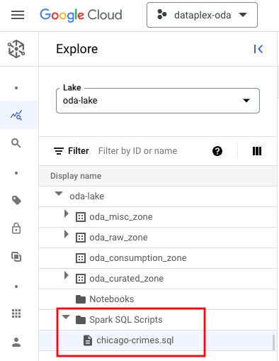
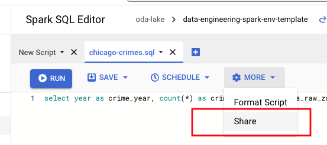
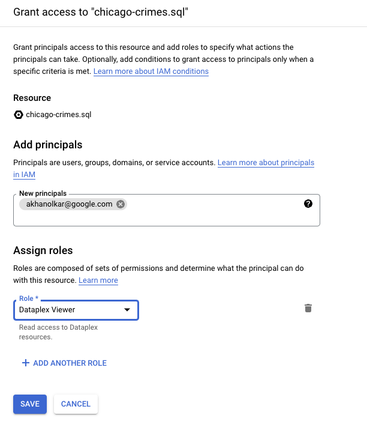
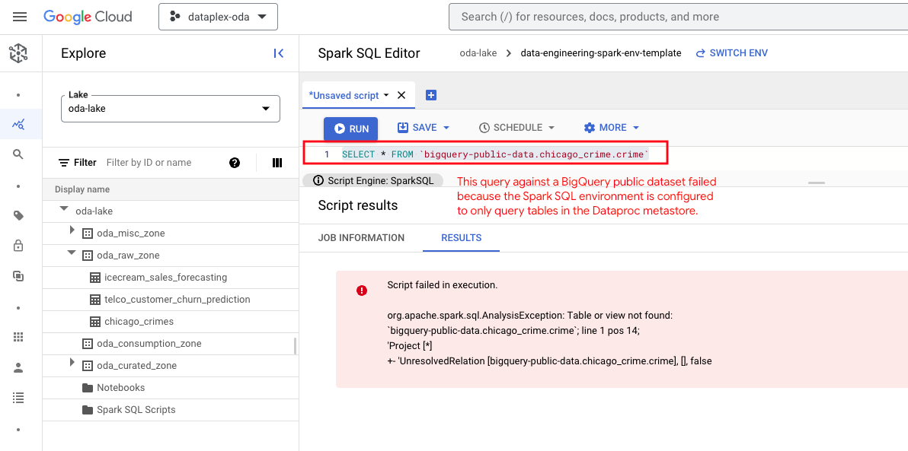

# Explore Dataplex entities with Spark SQL on Data Exploration Workbench

To recap, a queryable Dataplex entity is a table - a BigQuery table, or a BigLake table/external table on structured Cloud Storage objects in the Dataplex Lake. 

In this lab module, we will query the raw asset Chicago Crimes using Spark SQL on the Data Engineering DEW Environment.

## Lab

### 0. Prerequisites

If you run queries that use the BigQuery API, you willl need to grant the principal the following role-<br>
roles/serviceusage.serviceUsageConsumer

Lets go ahead and grant the User Managed Service Account the role, from Cloud Shell-

```
PROJECT_ID=`gcloud config list --format "value(core.project)" 2>/dev/null`
UMSA_FQN="lab-sa@${PROJECT_ID}.iam.gserviceaccount.com"

gcloud projects add-iam-policy-binding $PROJECT_ID --member=serviceAccount:$UMSA_FQN \
--role="roles/serviceusage.serviceUsageConsumer"

```


### 1. Navigate to the Spark SQL Workbench 
Navigate to the Dataplex UI -> Explore as showin below, in the Cloud Console-

   
<br><br>
<hr>

### 2. Query the GCS external table Chicago Crimes

Run the query below, which queries crimes in the table created in lab sub-module 4 in the raw zone.

```
select * from oda_raw_zone.chicago_crimes
```

Author's output-
   
<br><br>

Then run an aggregation query-
```
select year as crime_year, count(*) as crimes_count from oda_raw_zone.chicago_crimes group by year order by year desc
```
We will save this query in section 4.

<hr>

<hr>

### 3. Persist the SQL script

In Cloud Shell, paste the below. Grab the GCS URI fo the bucket directory chicago-crimes. We will persist the SQL into the same.

```
PROJECT_ID=`gcloud config list --format "value(core.project)" 2>/dev/null`
PROJECT_NBR=`gcloud projects describe $PROJECT_ID | grep projectNumber | cut -d':' -f2 |  tr -d "'" | xargs`
echo gs://oda-raw-code-$PROJECT_NBR/chicago-crimes
```

Follow the steps as shown below-<br>

   
<br><br>

   
<br><br>

Notice where the script is persisted - in the content store in Dataplex.

   
<br><br>

<hr>

### 4. Schedule the SQL script to run

We will schedule a report to run and write results to a GCS bucket.

#### 4.1. Schedule a script
```
PROJECT_ID=`gcloud config list --format "value(core.project)" 2>/dev/null`
PROJECT_NBR=`gcloud projects describe $PROJECT_ID | grep projectNumber | cut -d':' -f2 |  tr -d "'" | xargs`
VPC_NM="lab-vpc-$PROJECT_NBR"

UMSA_FQN="lab-sa@${PROJECT_ID}.iam.gserviceaccount.com"
LOCATION="us-central1"
LAKE_NM="oda-lake"
SQL_SCRIPT_CONTENT_STORE_URI="projects/$PROJECT_ID/locations/$LOCATION/lakes/$LAKE_NM/contentitems/chicago-crimes.sql"
RAND_VAL=$RANDOM

gcloud dataplex tasks create chicago-crimes-report-$RAND_VAL \
--project=$PROJECT_ID \
--location=$LOCATION \
--lake=$LAKE_NM \
--trigger-type=ON_DEMAND  \
--execution-service-account="$UMSA_FQN" \
--vpc-network-name="$VPC_NM"  \
--spark-sql-script="$SQL_SCRIPT_CONTENT_STORE_URI" \ 
--execution-args=^::^TASK_ARGS="--output_location,gs://oda-raw-data-36819656457/chicago-crimes-report-$RAND_VAL,--output_format,csv"

```

#### 4.2. Review the results in the bucket


<hr>

### 5. Share SQL scripts with other users

You can share scripts with other principals as shown below-

   
<br><br>

   
<br><br>

<hr>

### 6. Query a table in the BigQuery public dataset for Chicago crimes

Try running a query against a BigQuery dataset and it will fail. This is because the data Exploration Workbench only supports assets in the lake.


   
<br><br>

<hr>
This concludes the lab module. In the next module, we will learn to query metadata in the Dataproc Metastore (Apache Hive Metastore) with Spark SQL.
<hr>
